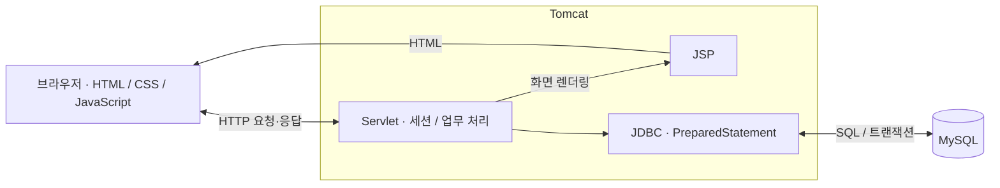

# 스튜디오·장비 예약 시스템

교수님이 교내 공간과 장비의 예약 현황을 확인하고, 예약·취소와 대여 내역 조회를 할 수 있도록 만든 웹 서비스입니다. 화면 구성부터 요청 처리, SQL 작성, 데이터베이스 설계까지 개인 프로젝트로 진행했습니다.

| 항목 | 내용 |
| --- | --- |
| 기간 | 2025.07 ~ 2025.12 |
| 형태 | 개인 프로젝트 |
| 담당 | JSP 화면, Servlet API, JDBC 데이터 처리, 가입 승인·예약·관리자 기능 |
| 주요 기술 | Java, JSP/Servlet, JDBC, MySQL, HTML/CSS, JavaScript, Tomcat, Maven |

## 개발 배경

공간 예약과 장비 대여를 한곳에서 확인할 수 있도록 만들고자 시작했습니다. 사용자는 캠퍼스·건물·층·날짜별로 예약 가능한 공간을 찾고, 관리자는 가입 요청과 공간·장비 정보를 관리하는 흐름으로 구성했습니다.

## 주요 기능

| 구분 | 구현 내용 |
| --- | --- |
| 회원 관리 | 가입 신청, 승인·반려, 로그인·로그아웃 |
| 공간 예약 | 위치·날짜·시간대별 현황 조회, 예약, 본인 예약 조회·취소 |
| 장비 대여 | 장비 분류·목록 조회, 대여 신청, 반납, 대여 내역 조회 |
| 관리자 화면 | 가입 요청 처리, 공간·장비 정보 관리, 사용자 관리 |

## 구현하면서 중점적으로 다룬 부분

### 가입 승인 과정의 트랜잭션

가입 요청을 승인할 때 계정만 생성되거나 승인 상태만 바뀌는 상황을 피하기 위해, 관련 작업을 하나의 JDBC 트랜잭션으로 묶었습니다.

1. `SELECT ... FOR UPDATE`로 가입 요청을 조회합니다.
2. 요청이 `PENDING` 상태인지 확인합니다.
3. `user_info`에 계정을 생성합니다.
4. 가입 요청을 `APPROVED`로 변경하고 처리자와 처리 시각을 기록합니다.
5. `user_signup_request_log`에 승인 이력을 저장한 뒤 커밋합니다.

처리 중 SQL 오류가 발생하면 롤백합니다. 승인 요청을 다시 처리할 때도 현재 상태를 확인하도록 구성했습니다.

- [가입 승인 코드](src/main/java/com/example/lim/AdminSignupApproveServlet.java)
- [가입 요청·이력 스키마](database/schema.sql)

### 동일 공간·시간대의 중복 예약 제한

예약 요청에서 캠퍼스·건물·층·공간·날짜·시간대가 같은 예약을 먼저 조회하고, 이미 예약되어 있으면 `409 Conflict`를 반환합니다. 조회와 저장 사이에 다른 요청이 들어올 수 있어 `reservation` 테이블에도 같은 조합의 UNIQUE 제약을 두었습니다.

현재 공간 예약 API는 `reservation` 테이블에 저장합니다. 저장 단계에서 DB 제약 위반이 발생했을 때의 응답은 일반 DB 오류로 처리하고 있어, 중복 충돌 응답을 일관되게 만드는 작업은 개선 과제로 남겼습니다.

- [공간 예약 코드](src/main/java/com/example/lim/ReservationServlet.java)

### 화면과 서버의 역할 분리

JSP와 JavaScript로 화면과 사용자 입력을 처리하고, Servlet에서 요청을 받아 `PreparedStatement`로 DB를 조회·변경합니다. 로그인 상태는 세션에 저장하며, `AuthFilter`에서 보호된 경로의 로그인 여부를 확인합니다.



## 기술 구성

| 구분 | 사용 기술 |
| --- | --- |
| 서버 | Java, Servlet API 3.0.1, JSP 2.2, JSTL |
| 데이터 처리 | JDBC, MySQL, MySQL Connector/J 5.1.48 |
| 화면 | HTML, CSS, JavaScript |
| 실행·빌드 | Tomcat 9.0.98, Maven, WAR 배포 |

`pom.xml`에는 Spring 3.1.1과 MyBatis 3.2.8 의존성도 포함되어 있습니다. 주요 예약·가입 승인 기능은 Servlet과 직접 작성한 JDBC 코드로 구현했습니다. Maven의 Java 컴파일 설정은 `source/target 1.6`으로 남아 있으므로 실행 환경을 구성할 때 프로젝트 JDK와 빌드 설정을 함께 확인해야 합니다.

## 주요 데이터

| 테이블 | 용도 |
| --- | --- |
| `user_info` | 승인된 사용자 계정 |
| `user_signup_request` | 가입 요청과 처리 상태 |
| `user_signup_request_log` | 가입 요청 상태 변경 이력 |
| `room` | 캠퍼스·건물·층·공간 정보 |
| `reservation` | 현재 공간 예약 API의 저장·조회 대상 |
| `tool` | 장비 분류와 상세 정보 |
| `tool_reservation` | 장비 대여 내역 |

스키마에는 `room_reservationfff`, `roompast`, `reservationpast`도 포함되어 있습니다. 전체 테이블과 제약조건은 [database/schema.sql](database/schema.sql)에 정리되어 있습니다. 공간 예약의 복합 UNIQUE 제약과 장비 대여의 제약조건은 구분해서 관리합니다.

## 실행 방법

### 1. DB 준비

프로젝트 루트에서 MySQL 클라이언트를 열고 아래 순서로 실행합니다. `schema.sql`이 `limlimlim` 데이터베이스를 생성하고 선택합니다.

```sql
SOURCE database/schema.sql;
SOURCE database/init_data.sql;
```

`init_data.sql`의 초기 계정 설정을 확인하고, Servlet·JSP에서 사용하는 DB 접속 정보를 로컬 환경에 맞춥니다. 코드에 들어 있는 `YOUR_DB_USER`, `YOUR_DB_PASSWORD`는 실행 환경의 값으로 설정해야 합니다.

### 2. Tomcat 배포

1. IDE에서 Maven 프로젝트로 엽니다.
2. 프로젝트 JDK와 `pom.xml`의 컴파일 설정을 확인합니다.
3. 로컬 Tomcat을 등록하고 WAR 또는 exploded WAR를 배포 대상으로 추가합니다.
4. 설정한 컨텍스트 경로로 접속합니다.

```text
http://localhost:8080/<컨텍스트 경로>/
```

Maven 빌드 명령은 `mvn clean package`이며, 생성된 WAR 파일명은 `target` 디렉터리에서 확인합니다.

## 개선 과제

- **인증·권한 처리**: 로그인 확인과 관리자 권한 검사를 공통 기준으로 정리하고, 회원 삭제를 포함한 관리자 요청의 권한 검사를 보완하려고 합니다.
- **비밀번호 관리**: 현재 비밀번호 직접 비교와 일부 표시 방식을 해시 검증·재설정 방식으로 바꾸고, 기존 계정의 전환 방법을 함께 정리하려고 합니다.
- **예약 충돌 처리**: 사전 조회와 DB 제약 위반에서 같은 중복 예약 응답을 반환하고, 동시 요청 상황을 테스트할 계획입니다.
- **실행 설정 정리**: 파일마다 작성한 DB 설정과 연결 코드를 모으고, 기존 테이블과 빌드 설정을 정리하려고 합니다.

## 개발자

임재민 · [GitHub](https://github.com/jeaminlim0000)
